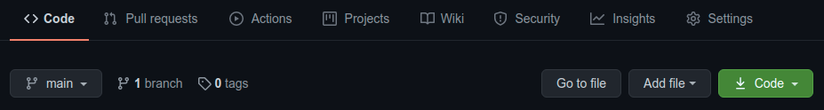
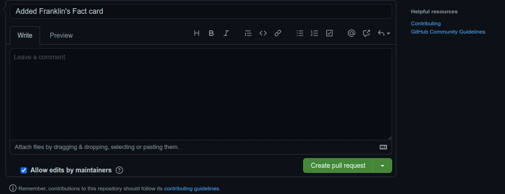

# Developer's Fact Card

## Welcome! 👋

Thanks for showing interest to contributing to this project.

This project is geared towards absolute beginners in open-source and of course any other person who wish to 

conribute.

Contributing to this project  allow you to improve your skills in a real-life workflow. By contributing to this

project you will learn:

- Git and Github usage.
- Collaboration.
- How to read, understand and follow instructions.
- How to make a pull request.
- How to work on a real life project and environment.
- Improve your reading ability.
- Basic command line knowledge

**To contribute to this project, you need:**

- To have a basic knowledge of HTML and CSS.
- To have [git](https://git-scm.com/) installed on your local machine.
- To be able to read, understand and follow instructions

## The contribution

Your contribution is to make a card for yourself which will include your name, your fact, your profession and 
your social media links. Very simple.

You don't need to write any HTML or CSS, you just need to understand what the markup means so as to be able to make changes.

The project already provides you with a card template as seen below, indicating where you should copy and paste to and then modify the template for yourself. Remember, follow every instruction

## How to start

First you need to have a copy of this project on your own Github account so that you can have it on your local machine and begin to make changes.

1. Star this repository, then go ahead and fork it, after that it will appear on your Github account as `Youraccountname/Developers-fact-card`.

2. Copy the URL of the project by clicking on the large big green button with "Code" written, Open the terminal on your local machine, make sure you have Git installed. Then run `git clone 'the URL you copied'`

3. By now you have the folder in your computer, so find the folder and open it in your preferred code editor, I will use VScode as a example here.

## Building your Fact card

Remember that this project is also meant to teach you and guide you how to read and heed to instructions. Make sure you read the instructions and heed to them.

1. You are only allowed to work on the `index.html` file and the `img` folder where you would be adding your image.

2. Look for the Template card with indications of green, telling you what to copy and where to paste it. It will look like this:

3. Copy the template that begins with `<section> `and ends with `</section>`, and paste it above after the last card, make sure you give one line for readability.

4. Now add a beautiful picture of you in the `img` folder, name the picture with your first name.

E.g if your first name is "precious" your image should be `precious.png` or `precious.jpg` as the case may be.

5. Now go ahead and add , your fact(your fact should be 2 lines only),your name, profession, and your social media links where indicated. DON'T MODIFY OR CHANGE ANY CLASS.

6. After that, you need to test if everything is okay, so view the project on your browser to see if your card is okay, by right clicking and clicking on `open with live server` or `open with browser`.

If there is an error, check if you modified or changed the markup or classes

## Pushing your project

If everything goes okay, beat your chest and say "Am a bad ass developer".

1. Open your terminal once again and run the following :

`git add img` and then commit your changes `git commit -m "Added my Image"`

You have commited your Image to Git!. NOw let commit your card.  Do that my running:

`git add index.html` and then commit your changes `git commit -m "Added "your name" card"`.

2. Now push your changes to your repository on your Github account.Now run:

`git push`.

Hooray!! You are getting there!

## Making a Pull request.

You must remember that this changes you made are visible on your own copy of the project you forked, so making a pull request will be asking me to add the changes to the original copy.

1. In your repository, click on the pull request tab, and then make a new pull request by clicking on the big green button with `new pull request` written on it and click on the next button with `create pull request`.

2. This is the last part of your pull request process, here you are going to add the title of your Pull request and an optional comment if you feel the need to. The title of your pull request should give informaton of your pull request. Follow the example below.

Now go ahead and make your pull request.!!  Hey you are an open-sourcer.....!!!

## Giving feedback

Feedback will be given to you  via email as your pull request is merged or rejected. But what can lead to a rejection of pull request. There are:

- Blurry Picture of you or a bad photo.
- Not following the instructions.
- Errors on your card.
- Not filling the appopriate spaces in the card.
- Modified or change anything you were asked not to change.

If you pull request is void of the above, be rest assured that it will be merged, as maintainers will attend to it in due time. 

Once merged/accepted, you can check your card on our live website [here](https://devfact.vercel.app/).

## Community Support

Just in-case you stumble on any stubborn error, you can reach me on [Twitter](https://twitter.com/DeveloperAspire)

**Have fun building!** 🚀

